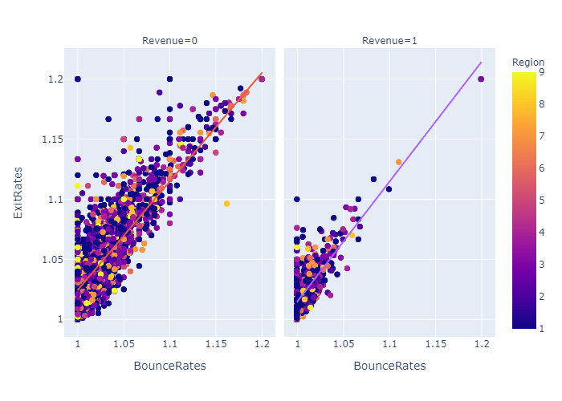
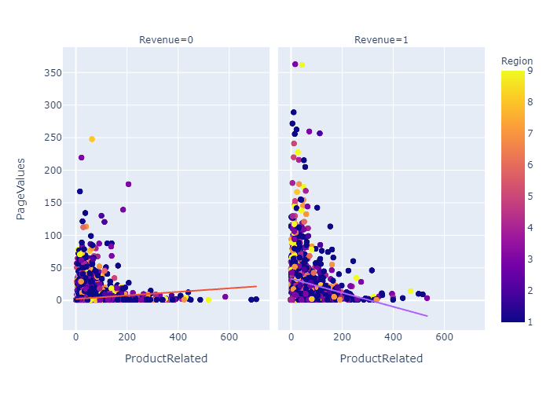
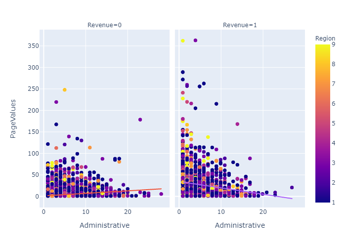
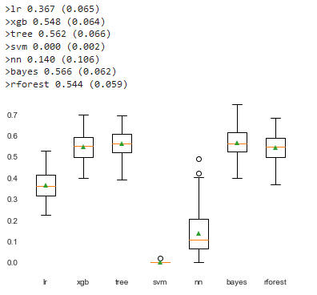
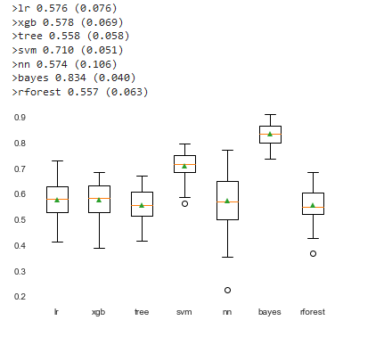
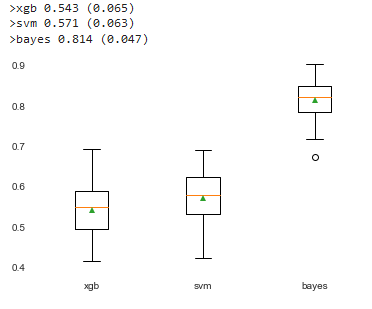
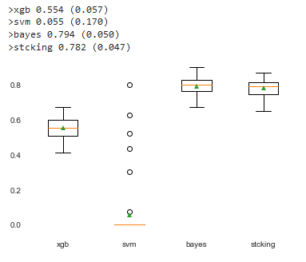
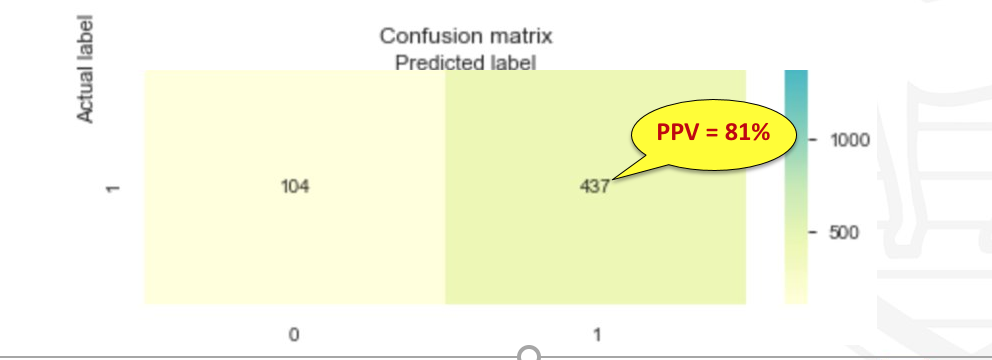
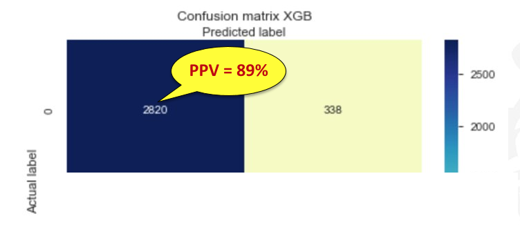
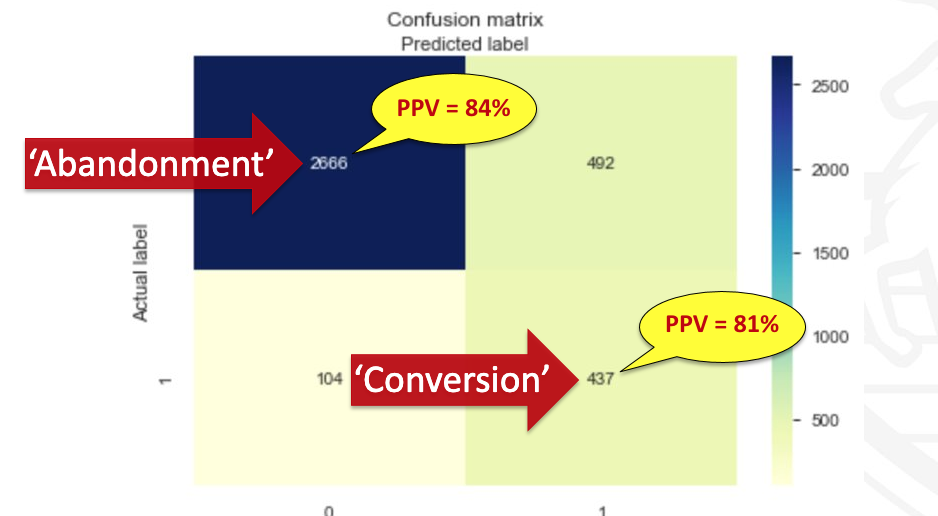

# **Analysis of Online Shoppers' Intention: What drives potential customers’ “conversion”?**
## BA545 Final Project for Machine Team 4
#### Brian Nicholls, Dawn Massey & Michael DiSanto

Note: This work was completed using the CRISP-DM Framework shown above; accordingly, it will serve as an organizing framework for this report.

## Part I: Business Issue Understanding
> Industry/Company/Products: **Columbia Sportswear Company**  
  Geography: **Turkey** 

 

**Research Question:** Overall, this project's research question is: What drives potential customers’ “conversion”?  
 

- Online shopping is an important revenue source for many retail businesses, such as our client
- According to Sakar et al. (2019), desipte increases in e-commerce traffic in the recent past, "conversion" (of browsers to purchasers) has not increased proportionately
- Global sales conversion rate = ~12.7%
- Our sales conversion rate = 15.5%

**Motivation:** Conversion increases are impactful: +10% conversions 🡪 +\$150,000 in new revenue
- 12,330 customers in 10 months 🡪 ~41 customers/day
- An increase of 10% in conversions 🡪 ~4.1 customers/day 
- At ~365 internet selling days/year 🡪 ~1,500 sales/year
- At ~100 dolllars/sale 🡪 \$150,000 increase in revenue

**What else do we know?**
     - 50% of Turkey’s population is under 30
     - Turkish population on average spend 30 hours a week online

 

## Part II: Data Understanding & Exploratory Data Analysis

#### Overview of Dataset: [Online Shoppers' Intention Data](./online_shoppers_intention.csv)
**Time Period:**  
- Data collection is between 2004 and July 2017  
- Data from 10 months only  -- Jan/Apr excluded

**Data source:** Online shopper browsing session data  

**Features:**  
    - Continuous Features - Metrics from Google Analytics  
    - Categorical Features - Data from URL information

The dataset that has been gathered for purposes of this analysis contains 12,330 unique visitors and 18 variables: Revenue, which is the Target Variable (where Revenue = TRUE if the customer visiting the website made a purchase - i.e., Class 1; and Revenue = FALSE if the customer visiting the website did not make a purchase - i.e., Class 0); and 17 predictor variables, including 10 continuous features and 7 categorical features, each of which are listed below and then delineated within our [Data Dictionary.](./images/Dictionary.PNG)  

_**Note:** See the data profile report here..._ [link.](./Customer_Intentions_Profile.html)

#### Questions revealed via EDA:

**Do BounceRates v. ExitRates influence No Sale/Sale the same?**

  
**Do PageValues v. ExitRates influence No Sale/Sale the same?**

  
**Do PageValues v. ProductRelated influence No Sale/Sale the same?**

   
**Do PageValues v. Administrative influence No Sale/Sale the same?**

  

_**Note:** See the Initial Data Audit Reoprt here..._ [link.](./MachineTeam4_Data_Audit_Report_Final.ipynb)

  

## Part III: Data Preparation
#### Overview of Steps (after csv imported):​
  
 **[Preliminary base models:​](./Model_1.6_Recall.ipynb)**
   - Encode non-numeric (object/boolean) features​
   - Run 7 models with all features & rank using repeated K-Fold​
   - Address RQ: What drives conversion PPV* for ‘sale’ (not F1)
  

**Resuts:** Preliminary base models
  

**[Initial base models/preparation process:​](./Model_2.6_Recall.ipynb)**
   - Impute, encode, bin (categorical features) – e.g., Bin 9 Regions to 5​
   - Transform, engineer features, standardize, normalize(continuous features) 
   – e.g., Engineer PageValues v ExitRates​
   - Run models & rank; evaluate via PPV for ‘sale’​ 
  

**Resuts:** Initial base models
  

    
_**Note:** See the Initial Data Models here..._ [link.](./Initial_Data_Models_Final.ipynb)

## Part IV: Analysis/Modeling/Evaluation
#### Overview of Steps (after data prep): ​

**[Revised base models:​](./Model_3.8_Recall.ipynb)**
- Remove duplicative/highly correlated features​
- Use 3 best models & determine top features for each​
- Run 3 “best features” models (NB, SVM, XGB)​
- Evaluate results via PPV for ‘sale’ & rank models
- Use TPOT to confirm optimal state with our models NB
  

**Resuts:** Revised base models
  
    
**[Final models (NB, SVM, XGB):​](./Model_4.6_SMOTE_Recall.ipynb)**
- Tune HPs* in 2 advanced machine learning models (SVM, XGB)
- Use SMOTE to adjust for imbalanced data​
- Run optimized models with ensemble; evaluate via PPV for ‘sale’​
 

**Resuts:** Final models (NB, SVM, XGB)
  

# Part V: Insights/Deployment
#### Naïve Bayes = best model to predict ‘conversion’​
  

_**Note:** TPOT confirms Naïve Bayes as best model; see the Exported TPOT Pipeline here..._ [link.](./tpot_exported_pipeline.py)  

#### NB model for ‘conversion’  17 features 

**Top 3 categorical features with recommendations:**  

- Timing of ‘sale’
    - Later Quarters
    - Weekends
    - **Recommendation:** Increase yearend/weekend marketing  
 
- Customer location
    - Certain Regions (1,2,3,4)
    - **Recommendation:** Target regions in marketing  
 

**Top 3 continuous features behavioral info:**
- Exit rates
    - BounceRates v ExitRates user satisfaction & conversion
    - **Insight:** Fewer exit-prone pages for conversion
    - **Recommendation:** Use exit rates to identify pages to improve  
 
- Page values
    - PageValues v ExitRates conversion
    - **Insight:** Higher page values for conversion
    - **Recommendation:** Identify what influence high page values  
 
- Product-related pages
    - ProductRelated  product-related web pages
    - **Insight:** Fewer product-related page views drive conversion​
    - **Recommendation:** Identify what reduces product-​related page views  
 
- Administrative
    - Admin v PageValues conversion…somewhat (In NB model – bottom half;​ not in SVM or SGB models)
    - **Insight:** Fewer administrative page views may drive conversion​
    - **Recommendation:** Minor feature in NB, not in other models;​
    - _Be cautious in expending resources to further investigate_  
  

#### How can we improve?
**Expand domain expertise/business knowledge​:**
- Search engine optimization experts​
- Sportswear retail segment​
- Turkish economy/geography/culture/customs​
    - Preferred sports? Seasonality?​
    - Valentine’s Day? Mother’s Day?  
 

**Obtain additional information/data​:**
- Timing of data collection​
- Uncollected data​
    - January/April data; additional year(s)​
    - Holidays other than Valentine’s Day/Mother’s Day​
    - Other unidentified features?  
 

#### What can we study next?
**Abandonment:** 
- What drives online shoppers to abandon
    - The site? the shopping cart?
    - Admin v PageValues may be important here

- What will reduce abandonment?
**Recommended Models:** 
- **Use XGBoost model to uniquely predict ‘abandonment’:** Best performance for ‘abandonment’
  

- **Use Naïve Bayes model for ‘abandonment’ _and_ ‘conversion’:** Balanced performance (for ‘abandonment & ‘conversion’) & Efficient use of resources
  

**Overall Observation:** KISS - Keep It Super Simple
- More sophisticated models:
- Don’t add much performance
- Require additional resources
    - Data preparation
    - Computing time
- **Possible explanation:** Simple models (e.g., Naieve Bayes) perform better as they more closely define the probabilistic relationship between the target and features for our dataset.

 

_**Note:** See the PowerPoint Presentaion here..._ [link.](./BA545-MachineTeam4_Project2_Presentation_FINAL.pdf)

 
 
 
 
 