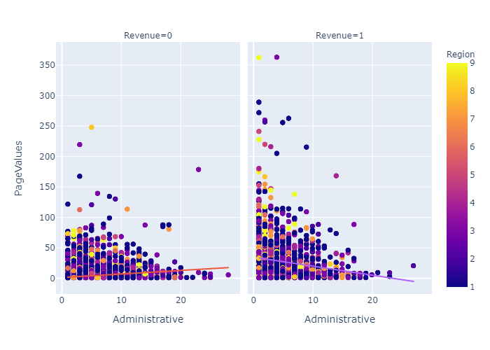

# Analysis of Online Shoppers’ “Conversion”
### BA545 Final Project for Machine Team 4
#### Brian Nicholls, Dawn Massey & Michael DiSanto

Note: This work was completed using the CRISP-DM Framework shown above; accordingly, it will serve as an organizing framework for this report.

## Part 1: Business Issue Understanding
> Industry/Company/Products: Columbia Sportswear Company

**Research Question:** Overall, this project's research question is: What drives potential customers’ “conversion”?

- Online shopping is an important revenue source for many retail businesses, such as our client. According to Sakar et al. (2019), desipte increases in e-commerce traffic in the recent past, "conversion" (of browsers to purchasers) has not increased proportionately.
- Global sales conversion rate = ~12.7%
- Our sales conversion rate = 15.5%

**Motivation:** Conversion increases are impactful!
- 12,330 customers in 10 months 🡪 ~41 customers/day
- An increase of 10% in conversions 🡪 ~4.1 customers/day 
- At ~365 internet selling days/year 🡪 ~1,500 sales/year
- At ~100 dolllars/sale 🡪 150,000 dollars increase in revenue

**What else do we know?**
- Geography: Turkey
    - 50% of Turkey’s population is under 30
    - Spendson average, 30 hours a week online
    
    
## Part II: Data Understanding & Exploratory Data Analysis

#### Overview of Dataset:
**Time Period:** 
_- Data collection is between 2004 and July 2017_
_- Data from 10 months only  -- Jan/Apr excluded_

**Data source: Online shopper browsing session data**  
**Features:**  
    _- Continuous Features - Metrics from Google Analytics_  
    _- Categorical Features - Data from URL information_

The dataset that has been gathered for purposes of this analysis contains 12,330 unique visitors and 18 variables: Revenue, which is the Target Variable (where Revenue = TRUE if the customer visiting the website made a purchase - i.e., Class 1; and Revenue = FALSE if the customer visiting the website did not make a purchase - i.e., Class 0); and 17 predictor variables, including 10 continuous features and 7 categorical features, each of which are listed below and then delineated within our [Data Dictionary.](./images/Dictionary.PNG)  

Alse see the initial data Audit reoprt

**What does the EDA reveal?**

>Do BounceRates v. ExitRates influence No Sale/Sale the same?
  Do PageValues v. ExitRates influence No Sale/Sale the same?
  Do PageValues v. ProductRelated influence No Sale/Sale the same?
  Do PageValues v. Administrative influence No Sale/Sale the same?

## Part III: Data Preparation
Overview of Steps (after csv imported):​
   1) Preliminary base models:​
    Encode non-numeric (object/boolean) features​
    Run 7 models with all features & rank using repeated K-Fold​
    Address RQ: What drives conversion PPV* for ‘sale’ (not F1) [Preliminary base models](./Model_1.6_Recall.ipynb)

   2) Initial base models/preparation process:​
    Impute, encode, bin (categorical features) – e.g., Bin 9 Regions to 5​
    Transform, engineer features, standardize, normalize(continuous features) –     e.g., Engineer PageValues v ExitRates​
    Run models & rank; evaluate via PPV for ‘sale’​ [Initial base models](./Model_2.6_Recall.ipynb)